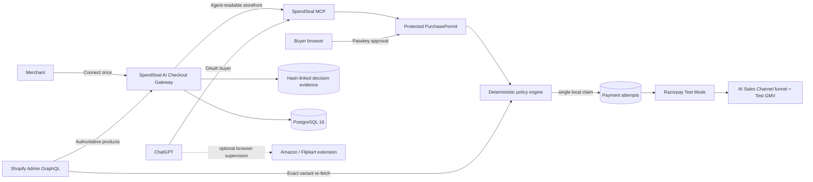

# SpendSeal

> Make your store purchasable by AI agents.

SpendSeal is an **AI Checkout Gateway for merchants**, built for Razorpay AI Buildathon Track 01. A merchant connects Shopify and Razorpay Test Mode once. SpendSeal publishes an agent-readable storefront that ChatGPT can discover, turns a buyer request into a bounded PurchasePermit, independently rechecks the final transaction, and creates at most one Razorpay Test Mode payment attempt.

The merchant owns product truth. The buyer owns authorization. ChatGPT can discover, explain, and recommend products, but it cannot invent a price, approve a PurchasePermit, increase a spending limit, bypass a passkey, or invoke an unprotected payment. SpendSeal's authorization firewall remains the technical control layer beneath the merchant-facing product.

No OpenAI API key or ChatGPT credential is used. ChatGPT connects through OAuth 2.1 and ordinary MCP tools. Amazon India and Flipkart browser supervision remains an additional buyer-side capability, but the primary Track 01 story is the stronger, provider-integrated Shopify → ChatGPT → Razorpay merchant flow.

## Judge quick read

**One-line pitch:** SpendSeal turns an existing Shopify and Razorpay merchant into an AI-transactable merchant while keeping every money action explainable, bounded, gated, single-use, and auditable.

### Merchant problem

Most online stores are designed for human browsing. AI agents cannot reliably obtain authoritative product data, know which checkout rules are current, or prove that a buyer approved the exact transaction. Giving an agent browser access solves clicking; it does not create an independent authorization boundary or a measurable merchant sales channel.

### AI-readable storefront

SpendSeal publishes the merchant name, active Shopify products, descriptions, variants, prices, availability, merchant-stated refund terms, supported currency, checkout capability, evidence assurance, and Razorpay Test Mode availability. The focused `get_merchant_storefront` MCP tool returns this information as one structured response. Repeated catalog calls are deduplicated in analytics and never store the buyer's prompt.

### ChatGPT purchase flow

ChatGPT discovers the merchant storefront, filters the authoritative products, and creates a PurchasePermit for one exact product revision. The permit binds the buyer, merchant, product, quantity one, maximum payable total, price-change rule, optional refund requirement, and expiry. ChatGPT cannot approve it. The signed-in buyer must review the terms and verify a passkey.

### Razorpay execution

After approval, SpendSeal automatically re-fetches the exact Shopify variant, runs deterministic policy, claims one local attempt, and only then creates a Razorpay Test Mode order. Webhook and payment signatures are verified using merchant-isolated encrypted credentials. Mock payments remain available for backup rehearsals but never count as Razorpay Test Mode GMV.

### Measured AI-commerce funnel

The merchant's **AI Sales Channel** shows:

1. AI catalog discoveries.
2. Products shown to AI buyers.
3. PurchasePermits created.
4. Passkey approvals.
5. Policy-allowed checkouts.
6. Razorpay Test orders created.
7. Razorpay Test payments verified.
8. Policy denials.

It also reports permit-to-approval rate, approval-to-payment rate, verified order count, **AI-attributed Test Mode GMV**, safely stopped purchases, and frequently selected products. Results are tenant isolated. Analytics store event identifiers and counts—not prompts, full addresses, tokens, card data, or payment credentials.

### Security boundary and graceful failure

- **Explainable:** the buyer sees the exact product revision, quantity, maximum, refund requirement, price-change rule, and expiry.
- **Bounded:** the PurchasePermit grants no general wallet or browsing authority.
- **Gated:** only the buyer's passkey can record approval.
- **Independently checked:** SpendSeal re-reads Shopify after approval rather than trusting ChatGPT's earlier observation.
- **Single use:** one permit can claim at most one order; replay produces `REPLAY_DETECTED`.
- **Auditable:** every authorization and payment decision is SHA-256 hash-linked in an append-only PostgreSQL chain.
- **Fails safely:** a changed price, exceeded budget, missing payment configuration, catalog refresh failure, or uncertain provider result creates no automatic retry.

### Browser-agent add-on

SpendSeal can also supervise Amazon India and Flipkart through a local Chromium extension. That path is valuable for third-party research and is labeled `browser_observed`, not provider-verified. It is a secondary demonstration because those websites are not the connected merchant, their layouts may change, and they do not prove revenue for the merchant using SpendSeal's AI Sales Channel.

### Demo readiness

| Area | Demo status | Honest limitation |
|---|---|---|
| Shopify storefront + ChatGPT MCP + PurchasePermit | Primary demo path | Merchant catalog must be connected and synchronized |
| Passkey approval + deterministic revalidation | Demo ready | Passkeys are bound to the exact production domain |
| Razorpay payment and webhook | Razorpay Test Mode only | Test GMV is not real revenue |
| Funnel analytics + readiness | Demo ready | Measures SpendSeal-attributed Test Mode events only |
| Price-change or replay denial | Demo ready | Use a separately rehearsed permit for the failure scene |
| Amazon India and Flipkart browser supervision | Optional secondary demo | Site layout and anti-bot controls can interrupt it |
| Public production release | Not ready | Needs operational monitoring, legal review, and public app distribution |

## Five-minute Razorpay Buildathon demo

1. **0:00-0:30 — Merchant problem.** Show the SpendSeal dashboard. Say: “Millions of merchants have websites designed for humans, but AI agents cannot reliably discover their catalogs, understand their checkout rules, or purchase with bounded authority. SpendSeal turns an existing Shopify and Razorpay merchant into an AI-transactable merchant.”
2. **0:30-1:00 — Merchant becomes AI-ready.** Show Shopify connected, Razorpay Test Mode connected, the readiness badge, and the copyable ChatGPT prompt. Say: “The merchant connects an authoritative Shopify catalog and Razorpay Test Mode once. SpendSeal exposes a structured storefront while keeping product truth under merchant control.”
3. **1:00-1:45 — ChatGPT discovers the merchant.** Paste the sample prompt into ChatGPT, open the merchant storefront, list products below the chosen amount, and select one. Say: “ChatGPT reads live authoritative products. It can search, explain, and recommend, but it cannot invent prices or approve a purchase.”
4. **1:45-2:30 — Create bounded authority.** Create the PurchasePermit and show product, quantity, maximum total, price-change rule, and expiry. Approve with the buyer's passkey. Say: “This is not open-ended spending permission. ChatGPT cannot approve it; the buyer's passkey is required.”
5. **2:30-3:15 — Razorpay Test Mode payment.** Prepare checkout and complete the rehearsed Test payment. Say: “SpendSeal re-fetches the exact Shopify variant, runs deterministic policy, claims one payment attempt, and only then creates the Razorpay Test order.”
6. **3:15-3:45 — Prove merchant value.** Return to the AI Sales Channel and show the updated funnel, one verified Test order, and the exact Test GMV. Say: “The merchant can measure discovery, authorization, policy approval, and Razorpay-verified Test conversion end to end.”
7. **3:45-4:20 — Audit evidence.** Open the PurchasePermit chain. Show `PURCHASE_PERMIT_CREATED`, passkey confirmation, `POLICY_ALLOWED`, `PAYMENT_ORDER_CREATED`, `PAYMENT_VERIFIED`, and valid chain verification.
8. **4:20-4:45 — Graceful failure.** Show either a changed-price permit with `PRICE_CHANGED` / `BUDGET_EXCEEDED`, or replay the paid permit and show `REPLAY_DETECTED`. Point out that no second Razorpay order exists.
9. **4:45-5:00 — Close.** Say: “SpendSeal gives merchants an AI sales channel without giving AI agents unrestricted financial authority. The merchant controls product truth, the buyer controls authorization, SpendSeal verifies, and Razorpay executes.”

Keep a mock-adapter permit ready as a zero-cost backup if the hosted Test checkout or network is unavailable. Label it clearly as mock evidence. Never display Shopify tokens, Razorpay keys, webhook secrets, full addresses, card details, OTPs, or UPI PINs.

## What is implemented

- PostgreSQL 16 with explicit migrations and tenant-safe composite catalog references.
- A merchant **AI Sales Channel** with four plain-language readiness states: `Not ready`, `Catalog ready`, `AI transactable`, and `Payment verified`.
- A focused, agent-readable merchant storefront containing only active authoritative products, current terms, Test Mode checkout capability, and accurate evidence assurance.
- Tenant-isolated, idempotent AI-commerce funnel events and merchant analytics. Verified Razorpay Test payments are the only events counted as Test Mode GMV; mock, denied, replayed, failed, and reconciliation-required attempts are excluded.
- Passkey registration/login, opaque hashed sessions, HttpOnly cookies, CSRF protection, idle and absolute expiry.
- Merchants, role memberships, one-time invitations, product CRUD, optimistic concurrency, archival, and immutable revisions.
- Shopify Admin GraphQL catalog connection with encrypted store tokens, `read_products` scope verification, INR validation, variant synchronization, immutable revisions, and an automatic exact-variant re-fetch immediately before policy evaluation.
- Merchant API keys with `ss_test_` prefix, scopes, hashes, expiry, last-use tracking, rotation-ready creation, and revocation. Existing legacy keys remain accepted until rotated.
- Per-merchant mock or Razorpay Test Mode configuration. Secrets use AES-256-GCM and are never returned after setup; Razorpay webhook secrets can be rotated and are revealed only once.
- Buyer-bound PurchasePermits with passkey approval, deterministic policy checks, one unique payment claim, replay prevention, and reconciliation-required failure handling.
- Merchant-specific raw-body Razorpay webhooks, HMAC verification, and per-merchant event deduplication.
- OAuth 2.1 authorization code + S256 PKCE for ChatGPT MCP, 15-minute access tokens, rotating 30-day refresh tokens, and reuse-family revocation.
- A Manifest V3 Chromium extension with runtime per-domain permissions, extension OAuth + PKCE, visible operator commands, redacted page structure, recommendation explanations, manual product-page detection, and fail-closed adapters.
- A 15-minute product-review checkpoint: clicking a recommended match or manually opening another product only creates a proposal. Checkout starts only after the buyer presses **Use this product**.
- OpenAI API prepaid-credit preparation with one-time billing enforcement, a timestamped USD/INR reference quote, a 10% conversion/issuer-fee buffer, masked organization binding, and no claim that a bank's final conversion is guaranteed.
- Buyer-bound Shopping Tasks and Purchase Seals covering product, variant, seller, quantity, complete payable total, delivery, return constraints, address fingerprint, adapter version, single-use execution, and a separate SHA-256 audit chain.
- Self-service live retail execution: any authenticated buyer can opt in from the SpendSeal dashboard without a Buyer ID or Vercel access. Every order still requires final passkey approval and revalidation. Set `BROWSER_LIVE_PURCHASE_ENABLED=false` as a deployment-wide emergency kill switch. Login, CAPTCHA, OTP, 3-D Secure, ambiguous pages, unrelated cart items, and external payment challenges always return control to the buyer.
- Separate SHA-256 hash-linked chains for each PurchasePermit and merchant administration stream. PostgreSQL triggers reject updates/deletes.
- JSON request logging, secret-safe audit payloads, rate limits, Zod validation, size limits, CORS, security headers, health/readiness, and graceful shutdown.

Security language is deliberately narrow: merchant-managed data is authoritative inside SpendSeal’s trust domain; refund terms are checked but not guaranteed; passkeys prove authenticator control, not legal identity; the audit chain is tamper-evident, not blockchain or externally anchored.

## Current verification status

The browser-agent build has been verified with:

- A clean TypeScript project-reference type check.
- Successful Vercel and Docker production builds.
- All 48 unit and PostgreSQL integration tests passing across six test files, including policy, cryptography, Shopify, OAuth rotation, tenant isolation, merchant readiness, storefront filtering, analytics deduplication, Test Mode GMV accuracy, product-review invalidation, payment concurrency, replay denial, adapter fixtures, and both audit chains.
- A healthy OrbStack Compose stack with PostgreSQL migrations ready at `/api/v1/health`.
- Extension package inspection confirming the six required Manifest V3 files are present in the downloadable ZIP; SpendSeal itself is the only permanent host and each shopping site is requested at runtime for one task.
- A production-container dependency audit reporting no known runtime vulnerabilities.

The PostgreSQL integration suite requires a running PostgreSQL instance. Real Amazon India and Flipkart sessions remain a controlled manual test because SpendSeal never bypasses site login or anti-bot challenges.
The real-site acceptance pass remains intentionally manual: Amazon India and Flipkart can change their page structure or require login, CAPTCHA, OTP, or another buyer action. SpendSeal stops instead of bypassing those controls or guessing when checkout evidence is unclear.

The Playwright specification covers the complete account → merchant → product → PurchasePermit → passkey → mock payment → audit flow. On macOS it requires a locally runnable Playwright Chromium installation with WebAuthn virtual-authenticator support.

## Deploy on Vercel

SpendSeal is configured as one Vercel project: Vercel serves the built React files and runs the Express REST, OAuth, MCP, and webhook routes as one function. PostgreSQL remains an external managed database because Vercel does not provide a built-in PostgreSQL database.

Use the permanent **Production** domain for every security setting. Do not use a changing Preview deployment hostname for passkeys or OAuth.

1. Import this GitHub repository in Vercel and keep the repository root as the project root. The checked-in `vercel.json` supplies the build command and function configuration.
2. In the Vercel Marketplace, create and connect a PostgreSQL provider such as Neon. Ensure the project receives a pooled `DATABASE_URL`. A new Vercel database starts empty; local OrbStack data is not copied automatically.
3. Choose the permanent production address before registering a passkey, for example `https://spendseal.vercel.app`.
4. Add these Production environment variables in **Project Settings → Environment Variables**:

   ```dotenv
   DATABASE_URL=the_pooled_postgresql_url_from_your_database_provider
   CREDENTIAL_ENCRYPTION_KEY=a_new_base64_encoded_32_byte_secret
   CREDENTIAL_ENCRYPTION_KEY_VERSION=1
   PUBLIC_BASE_URL=https://spendseal.vercel.app
   OAUTH_ISSUER=https://spendseal.vercel.app
   WEBAUTHN_ORIGIN=https://spendseal.vercel.app
   WEBAUTHN_RP_ID=spendseal.vercel.app
   WEBAUTHN_RP_NAME=SpendSeal
   SESSION_IDLE_MINUTES=30
   SESSION_ABSOLUTE_HOURS=8
   EXTENSION_OAUTH_CLIENT_ID=spendseal-browser-extension
   BROWSER_AGENT_ENABLED=true
   BROWSER_LIVE_PURCHASE_ENABLED=true
   OPENAI_CREDITS_LIVE_ENABLED=false
   GENERIC_WEB_LIVE_ENABLED=false
   DEMO_MODE=false
   ```

   Generate `CREDENTIAL_ENCRYPTION_KEY` locally with `openssl rand -base64 32`. Enter it directly in Vercel; never send it in chat or commit it. Replace the example domain everywhere with the exact production hostname and do not include a trailing slash.
5. Deploy to Production, then open `https://your-production-domain/api/v1/health`. A successful response reports PostgreSQL and migrations ready.
6. Register a new passkey on the production domain, create the merchant, and reconnect Shopify and Razorpay Test Mode. Passkeys enrolled on `localhost` or a temporary tunnel intentionally do not work on the Vercel hostname.
7. Connect ChatGPT Developer Mode to `https://your-production-domain/mcp` and complete OAuth again.
8. After Razorpay Test Mode is connected, copy SpendSeal’s newly generated webhook secret once and create the Razorpay webhook at `https://your-production-domain/api/webhooks/razorpay/{merchantId}`. Subscribe to `payment.captured` and `payment.failed`.

The serverless entry point caches the Express application per warm function, limits each function instance’s PostgreSQL pool, and serializes migrations with a PostgreSQL transaction advisory lock so concurrent cold starts cannot apply the same migration twice. Vercel builds generate `public/` from the React production output; that directory is intentionally ignored by Git.

## Run with OrbStack (recommended)

Requirements: OrbStack with Docker Compose support.

1. Create local environment configuration:

   ```bash
   cp .env.example .env
   openssl rand -base64 32
   ```

2. Put the generated value in `CREDENTIAL_ENCRYPTION_KEY` in `.env`.

3. Start PostgreSQL and SpendSeal:

   ```bash
   docker compose up --build -d
   docker compose ps
   ```

4. Open `http://localhost:43118`, create an account with a passkey, create a merchant, connect Shopify or publish a product manually, and connect the deterministic mock adapter or a Razorpay Test account. OrbStack uses host port 43118 so it can coexist with the Vite/API development ports.

5. Follow logs or stop safely:

   ```bash
   docker compose logs -f app postgres
   docker compose down
   ```

`docker compose down` retains `agentrail-postgres`. `docker compose down -v` permanently deletes the PostgreSQL volume, so use `-v` only when you intentionally want a blank platform.

The app process applies verified SQL migrations before listening. `/api/v1/health` becomes healthy only when PostgreSQL is reachable and migrations are ready.

### First-run product flow

1. Register a SpendSeal account with a device passkey.
2. Create your merchant trust domain.
3. Connect a Shopify development store and synchronize its real catalog, or publish a product manually.
4. Connect the deterministic mock adapter for a zero-cost demo, or connect that merchant’s Razorpay Test account.
5. Select the product in the buyer view and set the maximum spend, refund requirement, price-change policy, and expiry.
6. Create the PurchasePermit and open its one-time approval URL.
7. Approve with the same buyer account’s passkey.
8. Run the deterministic policy check and complete the Test Mode checkout.
9. Open the PurchasePermit audit explorer and verify its SHA-256 hash-linked chain.

The merchant controls authoritative product facts. The buyer controls authorization constraints. Neither ChatGPT nor an approval URL can approve the payment.

## Connect a Shopify development store

SpendSeal uses Shopify Admin GraphQL as the authoritative source for synchronized prices and availability. Shopify access tokens are encrypted with the same versioned AES-256-GCM credential vault as payment secrets and are never returned after setup.

1. In Shopify Admin, open **Settings → Apps and sales channels → Develop apps**.
2. Create a custom app named `SpendSeal Catalog Reader`.
3. Configure Admin API scopes and grant only `read_products`.
4. Install the app and copy its Admin API access token. Shopify displays this token only once.
5. In SpendSeal, create or select your merchant. In **Connect your Shopify development store**, enter the permanent domain such as `agentrail-test-store.myshopify.com` and the token. Do not paste the token into ChatGPT.
6. Choose the merchant-stated refund default. Shopify supplies product facts but does not guarantee refund fulfilment.
7. Click **Encrypt token, verify store, and sync**. Each Shopify variant becomes a separately purchasable SpendSeal product with an immutable revision.

For the bait-and-switch demonstration, create and approve a PurchasePermit, then change the selected variant price in Shopify and prepare checkout. SpendSeal automatically re-fetches that exact Shopify variant, records the observed revision, and deterministically rejects execution when the changed terms violate the mandate. **Sync Shopify now** remains available only to refresh the dashboard catalog early; it is not part of the security check.

This local Buildathon connector intentionally uses an admin-created custom app to avoid requiring a deployed OAuth callback during development. A public multi-store SaaS version should use Shopify app OAuth instead.

## Run locally with Node

Start PostgreSQL first (Compose can provide only the database):

```bash
docker compose up -d postgres
cp .env.example .env
# Add a real output from: openssl rand -base64 32
npm install --cache /tmp/spendseal-npm-cache
npm run dev
```

Open `http://localhost:5173`. Vite proxies `/api` and `/mcp` to port 43117.

| Runtime | Browser URL | API port | Intended use |
|---|---:|---:|---|
| OrbStack Compose | `http://localhost:43118` | Host `43118` → container `43117` | Recommended full stack |
| Local Vite + Node | `http://localhost:5173` | `43117` | Frontend development and hot reload |

Useful commands:

```bash
npm run db:migrate
npm run demo:seed
npm run typecheck
npm test
npm run build
npm run test:e2e
```

The old SQLite files under `data/` are legacy demo artifacts. The PostgreSQL rebuild does not import, change, or delete them.

## Optional NovaDesk rehearsal data

SpendSeal is empty by default. To create the labeled NovaDesk demo only when wanted:

1. Set `DEMO_MODE=true`.
2. Register the owner in the browser.
3. Set `DEMO_OWNER_USERNAME` to that username.
4. Run `npm run demo:seed`, or click the optional seed control shown in demo mode.

The command creates NovaDesk, three sample plans, and a merchant-isolated mock payment configuration. It is idempotent.

## Razorpay Test Mode per merchant

1. In Razorpay Dashboard, switch to Test Mode and generate a key beginning with `rzp_test_`.
2. If `RAZORPAY_KEY_ID` and `RAZORPAY_KEY_SECRET` are already in the local `.env`, click **Use Test keys already in .env**. Otherwise, enter them in the selected merchant’s SpendSeal payment panel.
3. Copy the generated webhook secret immediately; it is shown once.
4. In Razorpay, configure the displayed merchant-specific URL:

   `https://your-spendseal-host/api/webhooks/razorpay/{merchantId}`

5. Subscribe to `payment.captured` and relevant failure events.

If a webhook secret is exposed, use **Rotate webhook secret** in the owner payment panel, then immediately replace the secret on the matching Razorpay Test Mode webhook. The webhook secret is separate from the Razorpay API Key Secret. Do not place either value in screenshots, chat, recordings, source control, or browser logs. Razorpay may retry older webhook deliveries with the previous secret, but an emergency exposure rotation intentionally stops trusting that old secret.

Live keys are rejected. Every order records the payment-configuration version that made the provider request. Never paste Razorpay secrets into ChatGPT, frontend code, source control, or logs.

## Connect ChatGPT Developer Mode

Use an HTTPS origin and update all three values consistently:

```dotenv
PUBLIC_BASE_URL=https://your-host.example
OAUTH_ISSUER=https://your-host.example
WEBAUTHN_ORIGIN=https://your-host.example
WEBAUTHN_RP_ID=your-host.example
```

Restart and enroll the passkey again whenever the RP ID changes. Expose port 43117 with a free HTTPS tunnel, add `https://your-host.example/mcp` as the ChatGPT Developer Mode connection, and complete SpendSeal’s OAuth consent flow while signed in as the buyer.

Implemented MCP tools:

| Tool | Required scope | Behavior |
|---|---|---|
| `list_merchants` | `catalog:read` | Discovers active merchants |
| `list_products` | `catalog:read` | Reads one merchant’s active authoritative catalog |
| `get_merchant_storefront` | `catalog:read` | Returns one merchant's active products, terms, checkout capability, evidence assurance, and AI-sales readiness |
| `create_purchase_permit` | `intents:create` | Creates a mandate for the OAuth buyer; buyer ID is never accepted as input |
| `get_purchase_permit` | `intents:read` | Returns only the OAuth buyer’s mandate |
| `prepare_checkout` | `checkout:prepare` | Runs policy and claims at most one Test Mode order |
| `get_audit_trail` | `audit:read` | Returns only the OAuth buyer’s PurchasePermit evidence |
| `create_shopping_task` | `shopping:create` | Creates one Amazon India or Flipkart task; cannot select, approve, or order |
| `get_shopping_task` | `shopping:read` | Returns only the OAuth buyer's task, candidates, and Purchase Seal state |
| `get_shopping_task_audit` | `shopping:audit` | Verifies the separate browser-task SHA-256 evidence chain |
| `create_web_purchase_task` | `shopping:create` | Creates an exact-domain Amazon, Flipkart, OpenAI API credit, or generic one-time purchase task |
| `get_web_purchase_task` | `shopping:read` | Reads the buyer's web task and pending product-review proposal |
| `get_web_purchase_task_audit` | `shopping:audit` | Verifies the web-task audit chain |
| `get_browser_operator_state` | `shopping:read` | Returns only redacted page structure and operator results |
| `perform_browser_operator_action` | `shopping:create` | Queues visible navigation, scroll, click, select, or non-sensitive typing; cannot approve or submit |

## Install the local browser extension

The extension supports Chrome, Edge, Arc, Brave, and other Chromium browsers. It requests access only to the active task's exact HTTPS domain at runtime. It does not request cookie, browsing-history, password, or card-data access and uses the browser's existing signed-in session without copying credentials to SpendSeal.

1. Build everything with `npm run build`, or only the extension with `npm run build:extension`.
2. Open your browser's extension page, enable **Developer mode**, choose **Load unpacked**, and select `apps/extension/dist`.
3. Pin SpendSeal and open its side panel. Click **Connect SpendSeal**. OAuth opens `spendseal.vercel.app`; sign in with the same buyer account and authorize the three browser scopes.
4. In ChatGPT, ask SpendSeal to create a Shopping Task or Web Purchase Task with one website and a maximum complete payable total.
5. Open the task in the extension. SpendSeal shows up to three **Recommended matches** with rating/review/seller/delivery/price reasons. Clicking one opens a review card; it does not start checkout.
6. You may instead browse the approved website yourself. Opening another product page immediately replaces the proposal and invalidates every older observation, approval, and grant. Press **Use this product** to start checkout or **Keep browsing** to do nothing.
7. After confirmation, SpendSeal automatically activates Buy Now, uses the website's saved default address and delivery option, and asks only **Cash on Delivery** or **Online payment**.
8. For COD, SpendSeal selects it. For online payment, choose UPI, card, or netbanking directly on the website; SpendSeal never reads the underlying account or card details.
9. SpendSeal shows one protected confirmation with the masked destination, delivery/account, seller/variant, quantity, payment type, charges, recurrence status, assurance level, and final total. Approve it once with your passkey.
10. SpendSeal automatically re-checks the visible checkout. With real browser purchases off, the expected result is `PURCHASE_PREPARED` and no live order is submitted. If the buyer explicitly enables real browser purchases, a supported retail adapter may make one final submission after passkey approval and revalidation. Login, CAPTCHA, OTP, UPI, and bank challenges always stay with the buyer.

The build also produces `/downloads/spendseal-extension.zip?v=0.4.4`; the version query prevents an older ZIP from being reused by a browser or CDN cache. Amazon, Flipkart, and OpenAI are browser adapters, not official integrations. Their evidence is `browser_observed`; generic sites are `agent_assisted`; neither is provider-verified. Each authenticated buyer may turn real retail purchases on or off for their own account from the dashboard; no Buyer ID or Vercel setup is required. Real purchasing remains off for each buyer until that buyer explicitly opts in. Operators may set `BROWSER_LIVE_PURCHASE_ENABLED=false` only as an emergency deployment-wide shutdown. OpenAI and generic live execution additionally require their separate flags and stay off by default.

OAuth metadata is published at `/.well-known/oauth-protected-resource`, `/.well-known/oauth-authorization-server`, and `/.well-known/openid-configuration`. Authorization codes are single-use and expire after five minutes. Access tokens are opaque and live for fifteen minutes. Refresh tokens rotate and reuse revokes the whole family.

## Backup, restore, and key rotation

Backup:

```bash
docker compose exec -T postgres pg_dump -U agentrail -d agentrail -Fc > agentrail.backup
```

Restore into an empty database:

```bash
docker compose exec -T postgres pg_restore -U agentrail -d agentrail --clean --if-exists < agentrail.backup
```

Treat backups as secrets because they contain encrypted merchant credentials and hashed tokens. Store the matching encryption key separately.

To rotate credential encryption safely, generate a new 32-byte base64 key, increment `CREDENTIAL_ENCRYPTION_KEY_VERSION`, re-enter each merchant’s Razorpay Test credentials from the dashboard, verify the new configuration, then retire the old key only after all active configurations have moved. Merchant API-key rotation creates a replacement and revokes the old key atomically; copy the replacement immediately because it is shown only once.

## Architecture



## Repository map

```text
apps/web              React AI Sales Channel, buyer, approval, checkout, and audit UI
apps/server           Express REST, OAuth, MCP, WebAuthn, PostgreSQL, Razorpay adapters
apps/server/drizzle   Explicit ordered SQL migrations
packages/core         Shared schemas, policy engine, canonical hashing, reason codes
data                  Untouched legacy SQLite demo files
e2e                   Browser flows
evals                 ChatGPT MCP prompt evaluation material
```

## Scope

Included: Razorpay Test Mode, merchant AI-sales readiness and funnel analytics, agent-readable Shopify storefronts, local zero-cost deployment, multi-user/multi-merchant tenancy, product revisions, OAuth-bound MCP, passkeys, deterministic authorization, replay prevention, webhook verification, and tamper-evident audit evidence.

Out of scope: KYC, legal identity verification, independent merchant truth verification, refund fulfilment, subscriptions, automatic recharge, password recovery/email delivery, Shopify write access or automatic catalog webhooks, card/CVV/UPI-PIN/OTP storage or entry, anti-bot bypass, and externally anchored audit storage.

### About “buy from any website”

SpendSeal can now create an exact-domain generic task and let ChatGPT operate against a redacted page structure. Generic execution deliberately fails closed unless the item/service, destination account, one-time status, currency, every charge, complete total, and exact final control are all independently readable. The assurance labels are explicit:

- `provider_verified`: merchant/payment-provider integration evidence.
- `browser_observed`: audited Amazon, Flipkart, or OpenAI browser adapter.
- `agent_assisted`: generic website with lower-assurance independently checked visible evidence.
- `prepared_only`: no real order was submitted.

## License

MIT
