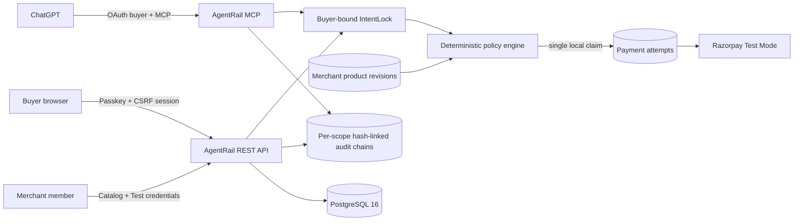

# AgentRail

> Merchants publish authoritative products. Buyers choose products and limits. ChatGPT interprets intent. Passkeys authorize. AgentRail enforces. Razorpay executes.

AgentRail is a multi-merchant authorization firewall for AI-initiated payments, built for Razorpay AI Buildathon Track 01. It starts with an empty catalog. NovaDesk is optional demo data, not the product model.

No OpenAI API key or ChatGPT credential is used. ChatGPT connects through OAuth 2.1 and calls ordinary MCP tools. No MCP tool can approve a mandate or complete payment.

## What is implemented

- PostgreSQL 16 with explicit migrations and tenant-safe composite catalog references.
- Passkey registration/login, opaque hashed sessions, HttpOnly cookies, CSRF protection, idle and absolute expiry.
- Merchants, role memberships, one-time invitations, product CRUD, optimistic concurrency, archival, and immutable revisions.
- Merchant API keys with `ar_test_` prefix, scopes, hashes, expiry, last-use tracking, rotation-ready creation, and revocation.
- Per-merchant mock or Razorpay Test Mode configuration. Secrets use AES-256-GCM and are never returned after setup.
- Buyer-bound IntentLocks with passkey approval, deterministic policy checks, one unique payment claim, replay prevention, and reconciliation-required failure handling.
- Merchant-specific raw-body Razorpay webhooks, HMAC verification, and per-merchant event deduplication.
- OAuth 2.1 authorization code + S256 PKCE for ChatGPT MCP, 15-minute access tokens, rotating 30-day refresh tokens, and reuse-family revocation.
- Separate SHA-256 hash-linked chains for each IntentLock and merchant administration stream. PostgreSQL triggers reject updates/deletes.
- JSON request logging, secret-safe audit payloads, rate limits, Zod validation, size limits, CORS, security headers, health/readiness, and graceful shutdown.

Security language is deliberately narrow: merchant-managed data is authoritative inside AgentRail’s trust domain; refund terms are checked but not guaranteed; passkeys prove authenticator control, not legal identity; the audit chain is tamper-evident, not blockchain or externally anchored.

## Current verification status

The checked-in build has been verified with:

- TypeScript project-reference type checking.
- Production builds for the shared core, Express server, and React frontend.
- Thirteen automated policy, cryptography, OAuth, PostgreSQL, concurrency, tenant-isolation, and audit-integrity tests.
- A production dependency audit with zero known runtime vulnerabilities.
- An OrbStack Compose build and health check with both PostgreSQL and AgentRail reporting healthy.
- An unauthenticated MCP probe returning `401 Unauthorized` with the OAuth protected-resource challenge.
- A browser smoke test of the production login page with no console errors.

The Playwright specification covers the complete account → merchant → product → IntentLock → passkey → mock payment → audit flow. On macOS it requires a locally runnable Playwright Chromium installation with WebAuthn virtual-authenticator support.

## Run with OrbStack (recommended)

Requirements: OrbStack with Docker Compose support.

1. Create local environment configuration:

   ```bash
   cp .env.example .env
   openssl rand -base64 32
   ```

2. Put the generated value in `CREDENTIAL_ENCRYPTION_KEY` in `.env`.

3. Start PostgreSQL and AgentRail:

   ```bash
   docker compose up --build -d
   docker compose ps
   ```

4. Open `http://localhost:43118`, create an account with a passkey, create a merchant, publish a product, and connect the deterministic mock adapter or a Razorpay Test account. OrbStack uses host port 43118 so it can coexist with the Vite/API development ports.

5. Follow logs or stop safely:

   ```bash
   docker compose logs -f app postgres
   docker compose down
   ```

`docker compose down` retains `agentrail-postgres`. `docker compose down -v` permanently deletes the PostgreSQL volume, so use `-v` only when you intentionally want a blank platform.

The app process applies verified SQL migrations before listening. `/api/v1/health` becomes healthy only when PostgreSQL is reachable and migrations are ready.

### First-run product flow

1. Register an AgentRail account with a device passkey.
2. Create your merchant trust domain.
3. Publish at least one product with a SKU, INR price, availability, and merchant-stated refund terms.
4. Connect the deterministic mock adapter for a zero-cost demo, or connect that merchant’s Razorpay Test account.
5. Select the product in the buyer view and set the maximum spend, refund requirement, price-change policy, and expiry.
6. Create the IntentLock and open its one-time approval URL.
7. Approve with the same buyer account’s passkey.
8. Run the deterministic policy check and complete the Test Mode checkout.
9. Open the IntentLock audit explorer and verify its SHA-256 hash-linked chain.

The merchant controls authoritative product facts. The buyer controls authorization constraints. Neither ChatGPT nor an approval URL can approve the payment.

## Run locally with Node

Start PostgreSQL first (Compose can provide only the database):

```bash
docker compose up -d postgres
cp .env.example .env
# Add a real output from: openssl rand -base64 32
npm install --cache /tmp/agentrail-npm-cache
npm run dev
```

Open `http://localhost:5173`. Vite proxies `/api` and `/mcp` to port 43117.

| Runtime | Browser URL | API port | Intended use |
|---|---:|---:|---|
| OrbStack Compose | `http://localhost:43118` | Host `43118` → container `43117` | Recommended full stack |
| Local Vite + Node | `http://localhost:5173` | `43117` | Frontend development and hot reload |

Useful commands:

```bash
npm run db:migrate
npm run demo:seed
npm run typecheck
npm test
npm run build
npm run test:e2e
```

The old SQLite files under `data/` are legacy demo artifacts. The PostgreSQL rebuild does not import, change, or delete them.

## Optional NovaDesk rehearsal data

AgentRail is empty by default. To create the labeled NovaDesk demo only when wanted:

1. Set `DEMO_MODE=true`.
2. Register the owner in the browser.
3. Set `DEMO_OWNER_USERNAME` to that username.
4. Run `npm run demo:seed`, or click the optional seed control shown in demo mode.

The command creates NovaDesk, three sample plans, and a merchant-isolated mock payment configuration. It is idempotent.

## Razorpay Test Mode per merchant

1. In Razorpay Dashboard, switch to Test Mode and generate a key beginning with `rzp_test_`.
2. In the selected merchant’s AgentRail payment panel, enter the Test Key ID and Key Secret.
3. Copy the generated webhook secret immediately; it is shown once.
4. In Razorpay, configure the displayed merchant-specific URL:

   `https://your-agentrail-host/api/webhooks/razorpay/{merchantId}`

5. Subscribe to `payment.captured` and relevant failure events.

Live keys are rejected. Every order records the payment-configuration version that made the provider request. Never paste Razorpay secrets into ChatGPT, frontend code, source control, or logs.

## Connect ChatGPT Developer Mode

Use an HTTPS origin and update all three values consistently:

```dotenv
PUBLIC_BASE_URL=https://your-host.example
OAUTH_ISSUER=https://your-host.example
WEBAUTHN_ORIGIN=https://your-host.example
WEBAUTHN_RP_ID=your-host.example
```

Restart and enroll the passkey again whenever the RP ID changes. Expose port 43117 with a free HTTPS tunnel, add `https://your-host.example/mcp` as the ChatGPT Developer Mode connection, and complete AgentRail’s OAuth consent flow while signed in as the buyer.

Implemented MCP tools:

| Tool | Required scope | Behavior |
|---|---|---|
| `list_merchants` | `catalog:read` | Discovers active merchants |
| `list_products` | `catalog:read` | Reads one merchant’s active authoritative catalog |
| `create_intent_lock` | `intents:create` | Creates a mandate for the OAuth buyer; buyer ID is never accepted as input |
| `get_intent_lock` | `intents:read` | Returns only the OAuth buyer’s mandate |
| `prepare_checkout` | `checkout:prepare` | Runs policy and claims at most one Test Mode order |
| `get_audit_trail` | `audit:read` | Returns only the OAuth buyer’s intent evidence |

OAuth metadata is published at `/.well-known/oauth-protected-resource`, `/.well-known/oauth-authorization-server`, and `/.well-known/openid-configuration`. Authorization codes are single-use and expire after five minutes. Access tokens are opaque and live for fifteen minutes. Refresh tokens rotate and reuse revokes the whole family.

## Backup, restore, and key rotation

Backup:

```bash
docker compose exec -T postgres pg_dump -U agentrail -d agentrail -Fc > agentrail.backup
```

Restore into an empty database:

```bash
docker compose exec -T postgres pg_restore -U agentrail -d agentrail --clean --if-exists < agentrail.backup
```

Treat backups as secrets because they contain encrypted merchant credentials and hashed tokens. Store the matching encryption key separately.

To rotate credential encryption safely, generate a new 32-byte base64 key, increment `CREDENTIAL_ENCRYPTION_KEY_VERSION`, re-enter each merchant’s Razorpay Test credentials from the dashboard, verify the new configuration, then retire the old key only after all active configurations have moved. Merchant API-key rotation creates a replacement and revokes the old key atomically; copy the replacement immediately because it is shown only once.

## Architecture



## Repository map

```text
apps/web              React multi-merchant, buyer, approval, checkout, and audit UI
apps/server           Express REST, OAuth, MCP, WebAuthn, PostgreSQL, Razorpay adapters
apps/server/drizzle   Explicit ordered SQL migrations
packages/core         Shared schemas, policy engine, canonical hashing, reason codes
data                  Untouched legacy SQLite demo files
e2e                   Browser flows
evals                 ChatGPT MCP prompt evaluation material
```

## Scope

Included: Razorpay Test Mode, local zero-cost deployment, merchant-managed catalogs, multi-user/multi-merchant tenancy, product revisions, OAuth-bound MCP, passkeys, deterministic authorization, replay prevention, webhook verification, and tamper-evident audit evidence.

Out of scope: live money, KYC, legal identity verification, independent merchant truth verification, refund fulfilment, subscriptions, fulfilment, password recovery/email delivery, third-party store synchronization, and externally anchored audit storage.

## License

MIT
