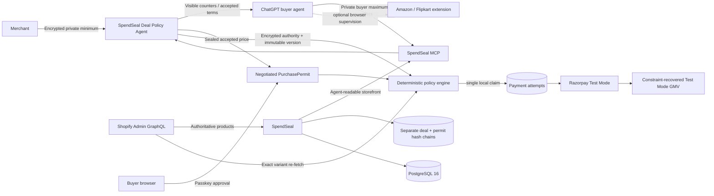

# SpendSeal

> Turn price-sensitive AI shoppers into paid orders.

SpendSeal is a **Bounded AI Dealmaker** for Razorpay AI Buildathon Track 01. A buyer privately gives ChatGPT a hard maximum. A merchant privately gives SpendSeal one encrypted minimum price. The buyer agent and deterministic merchant agent negotiate visibly for at most three offers without directly exposing either limit. An accepted deal becomes a single-use PurchasePermit, the buyer approves it with a passkey, SpendSeal revalidates every term, and Razorpay executes the negotiated Test Mode payment exactly once.

The primary outcome is **constraint-recovered Test Mode GMV**: a verified negotiated payment where the public Shopify price was above the buyer's original hard ceiling, so the ordinary checkout could not have converted.

No OpenAI API key or ChatGPT credential is used. ChatGPT connects through OAuth 2.1 and MCP. Shopify remains the authoritative catalog, merchant minimums use the existing AES-256-GCM credential vault, and Amazon/Flipkart browser supervision remains a secondary capability.

## Judge quick read

**One-line pitch:** SpendSeal lets buyer and merchant agents autonomously create a price both sides permit, then seals that agreement into one passkey-approved Razorpay Test payment.

### Merchant problem

Price-sensitive buyers often leave because a public price is slightly above their budget, while merchants cannot publish their true minimum without weakening the listed price for everyone. A browser agent can click checkout, but it cannot safely negotiate against two private limits or prove that neither party's authority was violated.

### AI-readable storefront

SpendSeal publishes the merchant name, active Shopify products, descriptions, variants, prices, availability, merchant-stated refund terms, supported currency, checkout capability, evidence assurance, and Razorpay Test Mode availability. The focused `get_merchant_storefront` MCP tool returns this information as one structured response. Repeated catalog calls are deduplicated in analytics and never store the buyer's prompt.

### Bounded negotiation

The merchant enables negotiation per product and enters one exact private minimum. That value is encrypted, versioned, tenant-isolated, and absent from MCP, buyer APIs, analytics, logs, and buyer-facing evidence. ChatGPT submits increasing offers that never exceed the buyer's original ceiling. SpendSeal returns decreasing merchant counters for two rounds; the third offer is accepted at or above merchant authority or ends as `NO_DEAL` without a final counter.

One buyer/product pair may have only one active deal, no more than three sessions in 24 hours, and no more than three offers per session. Policy changes invalidate unfinished deals. Idempotency and row locks prevent duplicate or concurrent accepted outcomes.

### Negotiated PurchasePermit

An accepted deal becomes a PurchasePermit bound to the buyer, merchant, exact Shopify revision and snapshot, public price, negotiated price, buyer ceiling, immutable policy version, accepted-offer hash, and deal expiry. ChatGPT cannot approve it. The signed-in buyer reviews public price, negotiated price, savings, refund terms, maximum, and expiry, then verifies a passkey.

### Razorpay execution

After approval, SpendSeal re-fetches the exact Shopify variant and verifies the same public price, revision, snapshot, availability, active policy version, deal expiry, buyer authority, and encrypted merchant authority. It atomically claims one local attempt and creates the Razorpay Test Mode order for the negotiated amount—not the public amount. Webhook and payment signatures are verified using merchant-isolated encrypted credentials.

### Measured AI-commerce funnel

The merchant's AI Sales Channel reports negotiations started, accepted and no-deal outcomes, average rounds, average public-price concession, deal-to-payment conversion, most-negotiated products, constraint-recovered Test orders, and constraint-recovered Test Mode GMV. Only verified Razorpay Test payments count. Mock, denied, expired, replayed, failed, and reconciliation-required outcomes add no GMV.

### Security boundary and graceful failure

- **Explainable:** every visible offer, counter, acceptance, approval, revalidation, order, and verified payment is recorded.
- **Bounded:** buyer offers cannot exceed the original ceiling; accepted prices cannot fall below encrypted merchant authority.
- **Gated:** only the buyer's passkey can record approval.
- **Independently checked:** SpendSeal re-reads Shopify and the immutable deal-policy version after approval.
- **Single use:** one permit can claim at most one order; replay produces `REPLAY_DETECTED`.
- **Auditable:** deals and PurchasePermits have separate SHA-256-linked append-only PostgreSQL chains; neither contains the merchant floor.
- **Fails safely:** `NO_DEAL`, expired deals, catalog or policy changes, replay, and uncertain provider results create no payment retry.

### Browser-agent add-on

SpendSeal can also supervise Amazon India and Flipkart through a local Chromium extension. That path is valuable for third-party research and is labeled `browser_observed`, not provider-verified. It is a secondary demonstration because those websites are not the connected merchant, their layouts may change, and they do not prove revenue for the merchant using SpendSeal's AI Sales Channel.

### Demo readiness

| Area | Demo status | Honest limitation |
|---|---|---|
| Encrypted product deal policy + three-round negotiation | Primary demo path | One product, quantity one, INR and price-only in v1 |
| Negotiated PurchasePermit + passkey revalidation | Demo ready | Passkeys are bound to the exact production domain |
| Negotiated Razorpay payment and webhook | Razorpay Test Mode only | Test GMV is not real revenue |
| Deal analytics + recovered Test Mode GMV | Demo ready | Counts only verified Razorpay Test payments |
| `NO_DEAL`, policy change, catalog change or replay | Demo ready | Failure creates no new Razorpay order |
| Amazon India and Flipkart browser supervision | Optional secondary demo | Site layout and anti-bot controls can interrupt it |
| Public production release | Not ready | Needs operational monitoring, legal review, and public app distribution |

## Five-minute Razorpay Buildathon demo

1. **0:00-0:35 — Lost conversion.** Show a Shopify product at ₹49.95. Say: “The buyer's hard maximum is ₹45, so the normal checkout cannot convert. The merchant could accept less, but cannot publish their private minimum.”
2. **0:35-1:05 — Private merchant authority.** In **Merchant AI Sales Closer**, enable negotiation and enter ₹42. Say: “This exact floor is AES-256-GCM encrypted and versioned. ChatGPT, the buyer, analytics, logs and buyer-facing evidence never receive it.”
3. **1:05-2:05 — Agents create the deal.** Ask ChatGPT to buy with a ₹45 hard maximum. Start at ₹40, show the merchant counters around ₹47.97 and ₹45.18, then make a final ₹45 offer. Say: “Buyer offers only rise, merchant counters only fall, and neither agent can cross its principal's authority.”
4. **2:05-2:45 — Seal and approve.** Create the negotiated PurchasePermit. Show ₹49.95 public, ₹45 negotiated, ₹4.95 savings, ₹45 maximum, expiry and Shopify revision. Approve with a passkey. Say: “ChatGPT can negotiate but cannot approve or pay.”
5. **2:45-3:30 — One Razorpay Test payment.** Prepare checkout and complete the rehearsed Test payment. Say: “SpendSeal re-fetches Shopify, decrypts and rechecks merchant authority, verifies the buyer ceiling and claims exactly one order at ₹45.”
6. **3:30-4:00 — Measured value.** Return to the dashboard and show one constraint-recovered Test order and ₹45 recovered Test Mode GMV. Say: “This conversion was recovered because public price exceeded the buyer's original ceiling.”
7. **4:00-4:30 — Explainable evidence.** Open the deal and permit audit chains. Show offers, counters, acceptance, passkey, revalidation, Razorpay order, payment verification, and valid hash chains. Point out that the floor is absent.
8. **4:30-4:50 — Graceful failure.** Replay the paid permit for `REPLAY_DETECTED`, then show a buyer maximum below merchant authority ending in `NO_DEAL`, no permit and no Razorpay order.
9. **4:50-5:00 — Close.** Say: “SpendSeal does not merely expose a catalog to AI. It lets buyer and merchant agents create a deal neither side can violate, then turns that agreement into one verified Razorpay payment.”

The presenter runbook is in [`docs/demo-script.md`](docs/demo-script.md). Keep the already verified Razorpay audit open as the first fallback. A separately prepared mock-adapter permit is the emergency provider-outage fallback; label it clearly as mock evidence and do not count it as recovered Test Mode GMV. Never display Shopify tokens, Razorpay keys, webhook secrets, full addresses, card details, OTPs, or UPI PINs.

## What is implemented

- A merchant **AI Sales Closer** for enabling negotiation per Shopify product with an exact private minimum encrypted in the versioned AES-256-GCM credential vault.
- Immutable deal-policy versions. Updating or disabling a policy invalidates every unfinished deal and negotiated permit tied to the older authority.
- A deterministic ten-minute negotiation state machine with at most three increasing buyer offers, decreasing merchant counters, one active buyer/product deal, three sessions per 24 hours, idempotency, and concurrency-safe final acceptance.
- Four buyer-bound MCP tools for starting, countering, reading, and sealing a negotiation. Merchant floors and buyer ceilings are not exposed to the opposite party.
- Negotiated PurchasePermits that preserve the public Shopify evidence while separately binding the accepted amount, savings, policy version, accepted-offer hash and deal expiry.
- Final negotiated policy evaluation that re-fetches Shopify, decrypts current merchant authority, checks the unchanged policy version and buyer ceiling, and creates the Razorpay Test order for the negotiated amount.
- A separate append-only SHA-256 deal chain covering visible offers, counters, acceptance or `NO_DEAL`, passkey approval, final revalidation, Razorpay order, verified payment and replay denial—without the merchant floor.
- Merchant deal analytics for starts, acceptances, no-deal outcomes, conversion, average rounds, average concession, most-negotiated products, constraint-recovered Test orders and constraint-recovered Test Mode GMV.
- PostgreSQL 16 with explicit migrations and tenant-safe composite catalog references.
- A merchant **AI Sales Channel** with four plain-language readiness states: `Not ready`, `Catalog ready`, `AI transactable`, and `Payment verified`.
- A focused, agent-readable merchant storefront containing only active authoritative products, current terms, Test Mode checkout capability, and accurate evidence assurance.
- Tenant-isolated, idempotent AI-commerce funnel events and merchant analytics. Verified Razorpay Test payments are the only events counted as Test Mode GMV; mock, denied, replayed, failed, and reconciliation-required attempts are excluded.
- Passkey registration/login, opaque hashed sessions, HttpOnly cookies, CSRF protection, idle and absolute expiry.
- Merchants, role memberships, one-time invitations, product CRUD, optimistic concurrency, archival, and immutable revisions.
- Shopify Admin GraphQL catalog connection with encrypted store tokens, `read_products` scope verification, INR validation, variant synchronization, immutable revisions, and an automatic exact-variant re-fetch immediately before policy evaluation.
- Merchant API keys with `ss_test_` prefix, scopes, hashes, expiry, last-use tracking, rotation-ready creation, and revocation. Existing legacy keys remain accepted until rotated.
- Per-merchant mock or Razorpay Test Mode configuration. Secrets use AES-256-GCM and are never returned after setup; Razorpay webhook secrets can be rotated and are revealed only once.
- Buyer-bound PurchasePermits with passkey approval, deterministic policy checks, one unique payment claim, replay prevention, and reconciliation-required failure handling.
- Merchant-specific raw-body Razorpay webhooks, HMAC verification, and per-merchant event deduplication.
- OAuth 2.1 authorization code + S256 PKCE for ChatGPT MCP, 15-minute access tokens, rotating 30-day refresh tokens, and reuse-family revocation.
- A Manifest V3 Chromium extension with runtime per-domain permissions, extension OAuth + PKCE, visible operator commands, redacted page structure, recommendation explanations, manual product-page detection, and fail-closed adapters.
- A 15-minute product-review checkpoint: clicking a recommended match or manually opening another product only creates a proposal. Checkout starts only after the buyer presses **Use this product**.
- OpenAI API prepaid-credit preparation with one-time billing enforcement, a timestamped USD/INR reference quote, a 10% conversion/issuer-fee buffer, masked organization binding, and no claim that a bank's final conversion is guaranteed.
- Buyer-bound Shopping Tasks and Purchase Seals covering product, variant, seller, quantity, complete payable total, delivery, return constraints, address fingerprint, adapter version, single-use execution, and a separate SHA-256 audit chain.
- Self-service live retail execution: any authenticated buyer can opt in from the SpendSeal dashboard without a Buyer ID or Vercel access. Every order still requires final passkey approval and revalidation. Set `BROWSER_LIVE_PURCHASE_ENABLED=false` as a deployment-wide emergency kill switch. Login, CAPTCHA, OTP, 3-D Secure, ambiguous pages, unrelated cart items, and external payment challenges always return control to the buyer.
- Separate SHA-256 hash-linked chains for each PurchasePermit and merchant administration stream. PostgreSQL triggers reject updates/deletes.
- JSON request logging, secret-safe audit payloads, rate limits, Zod validation, size limits, CORS, security headers, health/readiness, and graceful shutdown.

Security language is deliberately narrow: merchant-managed data is authoritative inside SpendSeal’s trust domain; refund terms are checked but not guaranteed; passkeys prove authenticator control, not legal identity; the audit chain is tamper-evident, not blockchain or externally anchored.

## Current verification status

The browser-agent build has been verified with:

- A clean TypeScript project-reference type check.
- Successful Vercel and Docker production builds.
- All 57 unit and PostgreSQL integration tests passing across seven test files, including negotiation thresholds, encrypted-floor privacy, monotonic offers, `NO_DEAL`, policy invalidation, negotiated payment amount, recovered-GMV accounting, ordinary policy, cryptography, Shopify, OAuth rotation, tenant isolation, analytics, payment concurrency, replay denial, browser adapter fixtures, and audit chains.
- A healthy OrbStack Compose stack with PostgreSQL migrations ready at `/api/v1/health`.
- Extension package inspection confirming the six required Manifest V3 files are present in the downloadable ZIP; SpendSeal itself is the only permanent host and each shopping site is requested at runtime for one task.
- A production-container dependency audit reporting no known runtime vulnerabilities.

The PostgreSQL integration suite requires a running PostgreSQL instance. Real Amazon India and Flipkart sessions remain a controlled manual test because SpendSeal never bypasses site login or anti-bot challenges.
The real-site acceptance pass remains intentionally manual: Amazon India and Flipkart can change their page structure or require login, CAPTCHA, OTP, or another buyer action. SpendSeal stops instead of bypassing those controls or guessing when checkout evidence is unclear.

The Playwright specification covers the complete account → merchant → product → PurchasePermit → passkey → mock payment → audit flow. On macOS it requires a locally runnable Playwright Chromium installation with WebAuthn virtual-authenticator support.

## Deploy on Vercel

SpendSeal is configured as one Vercel project: Vercel serves the built React files and runs the Express REST, OAuth, MCP, and webhook routes as one function. PostgreSQL remains an external managed database because Vercel does not provide a built-in PostgreSQL database.

Use the permanent **Production** domain for every security setting. Do not use a changing Preview deployment hostname for passkeys or OAuth.

1. Import this GitHub repository in Vercel and keep the repository root as the project root. The checked-in `vercel.json` supplies the build command and function configuration.
2. In the Vercel Marketplace, create and connect a PostgreSQL provider such as Neon. Ensure the project receives a pooled `DATABASE_URL`. A new Vercel database starts empty; local OrbStack data is not copied automatically.
3. Choose the permanent production address before registering a passkey, for example `https://spendseal.vercel.app`.
4. Add these Production environment variables in **Project Settings → Environment Variables**:

   ```dotenv
   DATABASE_URL=the_pooled_postgresql_url_from_your_database_provider
   CREDENTIAL_ENCRYPTION_KEY=a_new_base64_encoded_32_byte_secret
   CREDENTIAL_ENCRYPTION_KEY_VERSION=1
   PUBLIC_BASE_URL=https://spendseal.vercel.app
   OAUTH_ISSUER=https://spendseal.vercel.app
   WEBAUTHN_ORIGIN=https://spendseal.vercel.app
   WEBAUTHN_RP_ID=spendseal.vercel.app
   WEBAUTHN_RP_NAME=SpendSeal
   SESSION_IDLE_MINUTES=30
   SESSION_ABSOLUTE_HOURS=8
   EXTENSION_OAUTH_CLIENT_ID=spendseal-browser-extension
   BROWSER_AGENT_ENABLED=true
   BROWSER_LIVE_PURCHASE_ENABLED=true
   OPENAI_CREDITS_LIVE_ENABLED=false
   GENERIC_WEB_LIVE_ENABLED=false
   DEMO_MODE=false
   ```

   Generate `CREDENTIAL_ENCRYPTION_KEY` locally with `openssl rand -base64 32`. Enter it directly in Vercel; never send it in chat or commit it. Replace the example domain everywhere with the exact production hostname and do not include a trailing slash.
5. Deploy to Production, then open `https://your-production-domain/api/v1/health`. A successful response reports PostgreSQL and migrations ready.
6. Register a new passkey on the production domain, create the merchant, and reconnect Shopify and Razorpay Test Mode. Passkeys enrolled on `localhost` or a temporary tunnel intentionally do not work on the Vercel hostname.
7. Connect ChatGPT Developer Mode to `https://your-production-domain/mcp` and complete OAuth again.
8. After Razorpay Test Mode is connected, copy SpendSeal’s newly generated webhook secret once and create the Razorpay webhook at `https://your-production-domain/api/webhooks/razorpay/{merchantId}`. Subscribe to `payment.captured` and `payment.failed`.

The serverless entry point caches the Express application per warm function, limits each function instance’s PostgreSQL pool, and serializes migrations with a PostgreSQL transaction advisory lock so concurrent cold starts cannot apply the same migration twice. Vercel builds generate `public/` from the React production output; that directory is intentionally ignored by Git.

## Run with OrbStack (recommended)

Requirements: OrbStack with Docker Compose support.

1. Create local environment configuration:

   ```bash
   cp .env.example .env
   openssl rand -base64 32
   ```

2. Put the generated value in `CREDENTIAL_ENCRYPTION_KEY` in `.env`.

3. Start PostgreSQL and SpendSeal:

   ```bash
   docker compose up --build -d
   docker compose ps
   ```

4. Open `http://localhost:43118`, create an account with a passkey, create a merchant, connect Shopify or publish a product manually, and connect the deterministic mock adapter or a Razorpay Test account. OrbStack uses host port 43118 so it can coexist with the Vite/API development ports.

5. Follow logs or stop safely:

   ```bash
   docker compose logs -f app postgres
   docker compose down
   ```

`docker compose down` retains `agentrail-postgres`. `docker compose down -v` permanently deletes the PostgreSQL volume, so use `-v` only when you intentionally want a blank platform.

The app process applies verified SQL migrations before listening. `/api/v1/health` becomes healthy only when PostgreSQL is reachable and migrations are ready.

### First-run product flow

1. Register a SpendSeal account with a device passkey.
2. Create your merchant trust domain.
3. Connect a Shopify development store and synchronize its real catalog, or publish a product manually.
4. Select a product in **Merchant AI Sales Closer**, enter a private minimum below its public price, and enable negotiation.
5. Connect that merchant's Razorpay Test account. The mock adapter is useful only as a clearly labeled backup and does not count as recovered GMV.
6. Reconnect ChatGPT to SpendSeal so it discovers the `deals:create` and `deals:read` scopes and the four negotiation tools.
7. Ask ChatGPT to negotiate the selected product under a hard maximum. Submit up to three increasing offers.
8. When accepted, create the negotiated PurchasePermit and open its one-time approval URL.
9. Approve with the same buyer account's passkey, run final revalidation, and complete the Razorpay Test checkout.
10. Verify the separate deal and PurchasePermit chains and return to the dashboard to see constraint-recovered Test Mode GMV.

The merchant controls authoritative product facts. The buyer controls authorization constraints. Neither ChatGPT nor an approval URL can approve the payment.

## Connect a Shopify development store

SpendSeal uses Shopify Admin GraphQL as the authoritative source for synchronized prices and availability. Shopify access tokens are encrypted with the same versioned AES-256-GCM credential vault as payment secrets and are never returned after setup.

1. In Shopify Admin, open **Settings → Apps and sales channels → Develop apps**.
2. Create a custom app named `SpendSeal Catalog Reader`.
3. Configure Admin API scopes and grant only `read_products`.
4. Install the app and copy its Admin API access token. Shopify displays this token only once.
5. In SpendSeal, create or select your merchant. In **Connect your Shopify development store**, enter the permanent domain such as `agentrail-test-store.myshopify.com` and the token. Do not paste the token into ChatGPT.
6. Choose the merchant-stated refund default. Shopify supplies product facts but does not guarantee refund fulfilment.
7. Click **Encrypt token, verify store, and sync**. Each Shopify variant becomes a separately purchasable SpendSeal product with an immutable revision.

For the bait-and-switch demonstration, create and approve a PurchasePermit, then change the selected variant price in Shopify and prepare checkout. SpendSeal automatically re-fetches that exact Shopify variant, records the observed revision, and deterministically rejects execution when the changed terms violate the mandate. **Sync Shopify now** remains available only to refresh the dashboard catalog early; it is not part of the security check.

This local Buildathon connector intentionally uses an admin-created custom app to avoid requiring a deployed OAuth callback during development. A public multi-store SaaS version should use Shopify app OAuth instead.

## Run locally with Node

Start PostgreSQL first (Compose can provide only the database):

```bash
docker compose up -d postgres
cp .env.example .env
# Add a real output from: openssl rand -base64 32
npm install --cache /tmp/spendseal-npm-cache
npm run dev
```

Open `http://localhost:5173`. Vite proxies `/api` and `/mcp` to port 43117.

| Runtime | Browser URL | API port | Intended use |
|---|---:|---:|---|
| OrbStack Compose | `http://localhost:43118` | Host `43118` → container `43117` | Recommended full stack |
| Local Vite + Node | `http://localhost:5173` | `43117` | Frontend development and hot reload |

Useful commands:

```bash
npm run db:migrate
npm run demo:seed
npm run typecheck
npm test
npm run build
npm run test:e2e
```

The old SQLite files under `data/` are legacy demo artifacts. The PostgreSQL rebuild does not import, change, or delete them.

## Optional NovaDesk rehearsal data

SpendSeal is empty by default. To create the labeled NovaDesk demo only when wanted:

1. Set `DEMO_MODE=true`.
2. Register the owner in the browser.
3. Set `DEMO_OWNER_USERNAME` to that username.
4. Run `npm run demo:seed`, or click the optional seed control shown in demo mode.

The command creates NovaDesk, three sample plans, and a merchant-isolated mock payment configuration. It is idempotent.

## Razorpay Test Mode per merchant

1. In Razorpay Dashboard, switch to Test Mode and generate a key beginning with `rzp_test_`.
2. If `RAZORPAY_KEY_ID` and `RAZORPAY_KEY_SECRET` are already in the local `.env`, click **Use Test keys already in .env**. Otherwise, enter them in the selected merchant’s SpendSeal payment panel.
3. Copy the generated webhook secret immediately; it is shown once.
4. In Razorpay, configure the displayed merchant-specific URL:

   `https://your-spendseal-host/api/webhooks/razorpay/{merchantId}`

5. Subscribe to `payment.captured` and relevant failure events.

If a webhook secret is exposed, use **Rotate webhook secret** in the owner payment panel, then immediately replace the secret on the matching Razorpay Test Mode webhook. The webhook secret is separate from the Razorpay API Key Secret. Do not place either value in screenshots, chat, recordings, source control, or browser logs. Razorpay may retry older webhook deliveries with the previous secret, but an emergency exposure rotation intentionally stops trusting that old secret.

Live keys are rejected. Every order records the payment-configuration version that made the provider request. Never paste Razorpay secrets into ChatGPT, frontend code, source control, or logs.

## Connect ChatGPT Developer Mode

Use an HTTPS origin and update all three values consistently:

```dotenv
PUBLIC_BASE_URL=https://your-host.example
OAUTH_ISSUER=https://your-host.example
WEBAUTHN_ORIGIN=https://your-host.example
WEBAUTHN_RP_ID=your-host.example
```

Restart and enroll the passkey again whenever the RP ID changes. Expose port 43117 with a free HTTPS tunnel, add `https://your-host.example/mcp` as the ChatGPT Developer Mode connection, and complete SpendSeal’s OAuth consent flow while signed in as the buyer.

Implemented MCP tools:

| Tool | Required scope | Behavior |
|---|---|---|
| `list_merchants` | `catalog:read` | Discovers active merchants |
| `list_products` | `catalog:read` | Reads one merchant’s active authoritative catalog |
| `get_merchant_storefront` | `catalog:read` | Returns one merchant's active products, terms, checkout capability, evidence assurance, and AI-sales readiness |
| `start_price_negotiation` | `deals:create` | Starts a ten-minute deal with one first offer under the OAuth buyer's hard maximum |
| `counter_price_negotiation` | `deals:create` | Submits the next strictly higher buyer offer, up to three total offers |
| `get_price_negotiation` | `deals:read` | Returns only that OAuth buyer's visible offers, counters and accepted terms—never the merchant floor |
| `create_negotiated_purchase_permit` | `intents:create` | Seals one accepted unused deal into a passkey-gated single-use PurchasePermit |

The stable MCP URL is `https://spendseal.vercel.app/mcp`. If ChatGPT has cached
an older custom-app tool schema during development, reconnect the app once using
`https://spendseal.vercel.app/mcp-v3` to force fresh discovery of the deal tools.
| `create_purchase_permit` | `intents:create` | Creates a mandate for the OAuth buyer; buyer ID is never accepted as input |
| `get_purchase_permit` | `intents:read` | Returns only the OAuth buyer’s mandate |
| `prepare_checkout` | `checkout:prepare` | Runs policy and claims at most one Test Mode order |
| `get_audit_trail` | `audit:read` | Returns only the OAuth buyer’s PurchasePermit evidence |
| `create_shopping_task` | `shopping:create` | Creates one Amazon India or Flipkart task; cannot select, approve, or order |
| `get_shopping_task` | `shopping:read` | Returns only the OAuth buyer's task, candidates, and Purchase Seal state |
| `get_shopping_task_audit` | `shopping:audit` | Verifies the separate browser-task SHA-256 evidence chain |
| `create_web_purchase_task` | `shopping:create` | Creates an exact-domain Amazon, Flipkart, OpenAI API credit, or generic one-time purchase task |
| `get_web_purchase_task` | `shopping:read` | Reads the buyer's web task and pending product-review proposal |
| `get_web_purchase_task_audit` | `shopping:audit` | Verifies the web-task audit chain |
| `get_browser_operator_state` | `shopping:read` | Returns only redacted page structure and operator results |
| `perform_browser_operator_action` | `shopping:create` | Queues visible navigation, scroll, click, select, or non-sensitive typing; cannot approve or submit |

## Install the local browser extension

The extension supports Chrome, Edge, Arc, Brave, and other Chromium browsers. It requests access only to the active task's exact HTTPS domain at runtime. It does not request cookie, browsing-history, password, or card-data access and uses the browser's existing signed-in session without copying credentials to SpendSeal.

1. Build everything with `npm run build`, or only the extension with `npm run build:extension`.
2. Open your browser's extension page, enable **Developer mode**, choose **Load unpacked**, and select `apps/extension/dist`.
3. Pin SpendSeal and open its side panel. Click **Connect SpendSeal**. OAuth opens `spendseal.vercel.app`; sign in with the same buyer account and authorize the three browser scopes.
4. In ChatGPT, ask SpendSeal to create a Shopping Task or Web Purchase Task with one website and a maximum complete payable total.
5. Open the task in the extension. SpendSeal shows up to three **Recommended matches** with rating/review/seller/delivery/price reasons. Clicking one opens a review card; it does not start checkout.
6. You may instead browse the approved website yourself. Opening another product page immediately replaces the proposal and invalidates every older observation, approval, and grant. Press **Use this product** to start checkout or **Keep browsing** to do nothing.
7. After confirmation, SpendSeal automatically activates Buy Now, uses the website's saved default address and delivery option, and asks only **Cash on Delivery** or **Online payment**.
8. For COD, SpendSeal selects it. For online payment, choose UPI, card, or netbanking directly on the website; SpendSeal never reads the underlying account or card details.
9. SpendSeal shows one protected confirmation with the masked destination, delivery/account, seller/variant, quantity, payment type, charges, recurrence status, assurance level, and final total. Approve it once with your passkey.
10. SpendSeal automatically re-checks the visible checkout. With real browser purchases off, the expected result is `PURCHASE_PREPARED` and no live order is submitted. If the buyer explicitly enables real browser purchases, a supported retail adapter may make one final submission after passkey approval and revalidation. Login, CAPTCHA, OTP, UPI, and bank challenges always stay with the buyer.

The build also produces `/downloads/spendseal-extension.zip?v=0.4.4`; the version query prevents an older ZIP from being reused by a browser or CDN cache. Amazon, Flipkart, and OpenAI are browser adapters, not official integrations. Their evidence is `browser_observed`; generic sites are `agent_assisted`; neither is provider-verified. Each authenticated buyer may turn real retail purchases on or off for their own account from the dashboard; no Buyer ID or Vercel setup is required. Real purchasing remains off for each buyer until that buyer explicitly opts in. Operators may set `BROWSER_LIVE_PURCHASE_ENABLED=false` only as an emergency deployment-wide shutdown. OpenAI and generic live execution additionally require their separate flags and stay off by default.

OAuth metadata is published at `/.well-known/oauth-protected-resource`, `/.well-known/oauth-authorization-server`, and `/.well-known/openid-configuration`. Authorization codes are single-use and expire after five minutes. Access tokens are opaque and live for fifteen minutes. Refresh tokens rotate and reuse revokes the whole family.

## Backup, restore, and key rotation

Backup:

```bash
docker compose exec -T postgres pg_dump -U agentrail -d agentrail -Fc > agentrail.backup
```

Restore into an empty database:

```bash
docker compose exec -T postgres pg_restore -U agentrail -d agentrail --clean --if-exists < agentrail.backup
```

Treat backups as secrets because they contain encrypted merchant credentials and hashed tokens. Store the matching encryption key separately.

To rotate credential encryption safely, generate a new 32-byte base64 key, increment `CREDENTIAL_ENCRYPTION_KEY_VERSION`, re-enter each merchant’s Razorpay Test credentials from the dashboard, verify the new configuration, then retire the old key only after all active configurations have moved. Merchant API-key rotation creates a replacement and revokes the old key atomically; copy the replacement immediately because it is shown only once.

## Architecture



## Repository map

```text
apps/web              React AI Sales Channel, buyer, approval, checkout, and audit UI
apps/server           Express REST, OAuth, MCP, WebAuthn, PostgreSQL, Razorpay adapters
apps/server/drizzle   Explicit ordered SQL migrations
packages/core         Shared schemas, policy engine, canonical hashing, reason codes
data                  Untouched legacy SQLite demo files
e2e                   Browser flows
evals                 ChatGPT MCP prompt evaluation material
```

## Scope

Included: one-product quantity-one INR price negotiation, encrypted merchant minimums, private buyer ceilings, three-round deterministic bargaining, Razorpay Test Mode, constraint-recovered GMV analytics, agent-readable Shopify storefronts, multi-user/multi-merchant tenancy, OAuth-bound MCP, passkeys, replay prevention, webhook verification, and tamper-evident audit evidence.

Out of scope: quantities other than one, bundles, add-ons, non-INR negotiation, free-form contract terms, LLM-generated merchant strategy, KYC, legal identity verification, independent merchant truth verification, refund fulfilment, subscriptions, automatic recharge, Shopify write access, card/CVV/UPI-PIN/OTP storage or entry, anti-bot bypass, and externally anchored audit storage.

### About “buy from any website”

SpendSeal can now create an exact-domain generic task and let ChatGPT operate against a redacted page structure. Generic execution deliberately fails closed unless the item/service, destination account, one-time status, currency, every charge, complete total, and exact final control are all independently readable. The assurance labels are explicit:

- `provider_verified`: merchant/payment-provider integration evidence.
- `browser_observed`: audited Amazon, Flipkart, or OpenAI browser adapter.
- `agent_assisted`: generic website with lower-assurance independently checked visible evidence.
- `prepared_only`: no real order was submitted.

## License

MIT
