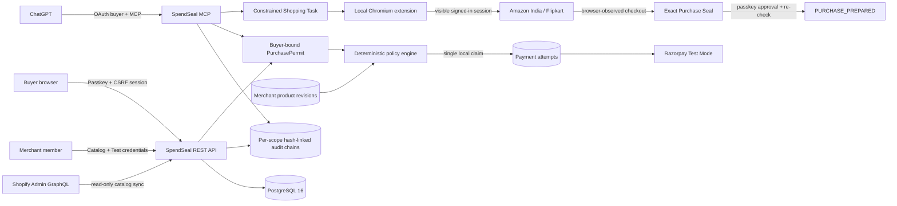

# SpendSeal

> Merchants publish authoritative products. Buyers choose products and limits. ChatGPT interprets intent. Passkeys authorize. SpendSeal enforces. Razorpay executes.

SpendSeal is a multi-merchant authorization firewall for AI-initiated payments, built for Razorpay AI Buildathon Track 01. It starts with an empty catalog. NovaDesk is optional demo data, not the product model.

SpendSeal also includes a prepare-only browser purchasing agent for Amazon India and Flipkart. ChatGPT creates a constrained Shopping Task, the buyer chooses one exact listing, the local extension visibly reaches checkout using the buyer's existing signed-in browser, and a passkey approves the exact observed total. The extension re-checks every condition and records `PURCHASE_PREPARED`; it does not place a real order.

No OpenAI API key or ChatGPT credential is used. ChatGPT connects through OAuth 2.1 and calls ordinary MCP tools. No MCP tool can approve a mandate or complete payment.

## What is implemented

- PostgreSQL 16 with explicit migrations and tenant-safe composite catalog references.
- Passkey registration/login, opaque hashed sessions, HttpOnly cookies, CSRF protection, idle and absolute expiry.
- Merchants, role memberships, one-time invitations, product CRUD, optimistic concurrency, archival, and immutable revisions.
- Shopify Admin GraphQL catalog connection with encrypted store tokens, `read_products` scope verification, INR validation, variant synchronization, immutable revisions, and an automatic exact-variant re-fetch immediately before policy evaluation.
- Merchant API keys with `ss_test_` prefix, scopes, hashes, expiry, last-use tracking, rotation-ready creation, and revocation. Existing legacy keys remain accepted until rotated.
- Per-merchant mock or Razorpay Test Mode configuration. Secrets use AES-256-GCM and are never returned after setup; Razorpay webhook secrets can be rotated and are revealed only once.
- Buyer-bound PurchasePermits with passkey approval, deterministic policy checks, one unique payment claim, replay prevention, and reconciliation-required failure handling.
- Merchant-specific raw-body Razorpay webhooks, HMAC verification, and per-merchant event deduplication.
- OAuth 2.1 authorization code + S256 PKCE for ChatGPT MCP, 15-minute access tokens, rotating 30-day refresh tokens, and reuse-family revocation.
- A Manifest V3 Chromium extension for Amazon India and Flipkart with exact host permissions, extension OAuth + PKCE, visible navigation, three-candidate selection, checkout observation, and fail-closed adapters.
- Buyer-bound Shopping Tasks and Purchase Seals covering product, variant, seller, quantity, complete payable total, delivery, return constraints, address fingerprint, adapter version, single-use execution, and a separate SHA-256 audit chain.
- Prepare-only execution by default (`BROWSER_LIVE_PURCHASE_ENABLED=false`). Login, CAPTCHA, OTP, 3-D Secure, ambiguous pages, unrelated cart items, and external payment challenges always return control to the buyer.
- Separate SHA-256 hash-linked chains for each PurchasePermit and merchant administration stream. PostgreSQL triggers reject updates/deletes.
- JSON request logging, secret-safe audit payloads, rate limits, Zod validation, size limits, CORS, security headers, health/readiness, and graceful shutdown.

Security language is deliberately narrow: merchant-managed data is authoritative inside SpendSeal’s trust domain; refund terms are checked but not guaranteed; passkeys prove authenticator control, not legal identity; the audit chain is tamper-evident, not blockchain or externally anchored.

## Current verification status

The browser-agent build has been verified with:

- A clean TypeScript project-reference type check.
- Successful Vercel and Docker production builds.
- All 33 unit and PostgreSQL integration tests passing across six test files, including policy, cryptography, Shopify, OAuth rotation, tenant isolation, payment concurrency, browser execution concurrency, replay denial, adapter fixtures, and both audit chains.
- A healthy OrbStack Compose stack with PostgreSQL migrations ready at `/api/v1/health`.
- Extension package inspection confirming the six required Manifest V3 files are present in the downloadable ZIP and only the declared Amazon India, Flipkart, and SpendSeal origins are granted host access.
- A production-container dependency audit reporting no known runtime vulnerabilities.

The PostgreSQL integration suite requires a running PostgreSQL instance. Real Amazon India and Flipkart sessions remain a controlled manual test because SpendSeal never bypasses site login or anti-bot challenges.
The real-site acceptance pass remains intentionally manual: Amazon India and Flipkart can change their page structure or require login, CAPTCHA, OTP, or another buyer action. SpendSeal stops instead of bypassing those controls or guessing when checkout evidence is unclear.

The Playwright specification covers the complete account → merchant → product → PurchasePermit → passkey → mock payment → audit flow. On macOS it requires a locally runnable Playwright Chromium installation with WebAuthn virtual-authenticator support.

## Deploy on Vercel

SpendSeal is configured as one Vercel project: Vercel serves the built React files and runs the Express REST, OAuth, MCP, and webhook routes as one function. PostgreSQL remains an external managed database because Vercel does not provide a built-in PostgreSQL database.

Use the permanent **Production** domain for every security setting. Do not use a changing Preview deployment hostname for passkeys or OAuth.

1. Import this GitHub repository in Vercel and keep the repository root as the project root. The checked-in `vercel.json` supplies the build command and function configuration.
2. In the Vercel Marketplace, create and connect a PostgreSQL provider such as Neon. Ensure the project receives a pooled `DATABASE_URL`. A new Vercel database starts empty; local OrbStack data is not copied automatically.
3. Choose the permanent production address before registering a passkey, for example `https://spendseal.vercel.app`.
4. Add these Production environment variables in **Project Settings → Environment Variables**:

   ```dotenv
   DATABASE_URL=the_pooled_postgresql_url_from_your_database_provider
   CREDENTIAL_ENCRYPTION_KEY=a_new_base64_encoded_32_byte_secret
   CREDENTIAL_ENCRYPTION_KEY_VERSION=1
   PUBLIC_BASE_URL=https://spendseal.vercel.app
   OAUTH_ISSUER=https://spendseal.vercel.app
   WEBAUTHN_ORIGIN=https://spendseal.vercel.app
   WEBAUTHN_RP_ID=spendseal.vercel.app
   WEBAUTHN_RP_NAME=SpendSeal
   SESSION_IDLE_MINUTES=30
   SESSION_ABSOLUTE_HOURS=8
   EXTENSION_OAUTH_CLIENT_ID=spendseal-browser-extension
   BROWSER_AGENT_ENABLED=true
   BROWSER_LIVE_PURCHASE_ENABLED=false
   DEMO_MODE=false
   ```

   Generate `CREDENTIAL_ENCRYPTION_KEY` locally with `openssl rand -base64 32`. Enter it directly in Vercel; never send it in chat or commit it. Replace the example domain everywhere with the exact production hostname and do not include a trailing slash.
5. Deploy to Production, then open `https://your-production-domain/api/v1/health`. A successful response reports PostgreSQL and migrations ready.
6. Register a new passkey on the production domain, create the merchant, and reconnect Shopify and Razorpay Test Mode. Passkeys enrolled on `localhost` or a temporary tunnel intentionally do not work on the Vercel hostname.
7. Connect ChatGPT Developer Mode to `https://your-production-domain/mcp` and complete OAuth again.
8. After Razorpay Test Mode is connected, copy SpendSeal’s newly generated webhook secret once and create the Razorpay webhook at `https://your-production-domain/api/webhooks/razorpay/{merchantId}`. Subscribe to `payment.captured` and `payment.failed`.

The serverless entry point caches the Express application per warm function, limits each function instance’s PostgreSQL pool, and serializes migrations with a PostgreSQL transaction advisory lock so concurrent cold starts cannot apply the same migration twice. Vercel builds generate `public/` from the React production output; that directory is intentionally ignored by Git.

## Run with OrbStack (recommended)

Requirements: OrbStack with Docker Compose support.

1. Create local environment configuration:

   ```bash
   cp .env.example .env
   openssl rand -base64 32
   ```

2. Put the generated value in `CREDENTIAL_ENCRYPTION_KEY` in `.env`.

3. Start PostgreSQL and SpendSeal:

   ```bash
   docker compose up --build -d
   docker compose ps
   ```

4. Open `http://localhost:43118`, create an account with a passkey, create a merchant, connect Shopify or publish a product manually, and connect the deterministic mock adapter or a Razorpay Test account. OrbStack uses host port 43118 so it can coexist with the Vite/API development ports.

5. Follow logs or stop safely:

   ```bash
   docker compose logs -f app postgres
   docker compose down
   ```

`docker compose down` retains `agentrail-postgres`. `docker compose down -v` permanently deletes the PostgreSQL volume, so use `-v` only when you intentionally want a blank platform.

The app process applies verified SQL migrations before listening. `/api/v1/health` becomes healthy only when PostgreSQL is reachable and migrations are ready.

### First-run product flow

1. Register a SpendSeal account with a device passkey.
2. Create your merchant trust domain.
3. Connect a Shopify development store and synchronize its real catalog, or publish a product manually.
4. Connect the deterministic mock adapter for a zero-cost demo, or connect that merchant’s Razorpay Test account.
5. Select the product in the buyer view and set the maximum spend, refund requirement, price-change policy, and expiry.
6. Create the PurchasePermit and open its one-time approval URL.
7. Approve with the same buyer account’s passkey.
8. Run the deterministic policy check and complete the Test Mode checkout.
9. Open the PurchasePermit audit explorer and verify its SHA-256 hash-linked chain.

The merchant controls authoritative product facts. The buyer controls authorization constraints. Neither ChatGPT nor an approval URL can approve the payment.

## Connect a Shopify development store

SpendSeal uses Shopify Admin GraphQL as the authoritative source for synchronized prices and availability. Shopify access tokens are encrypted with the same versioned AES-256-GCM credential vault as payment secrets and are never returned after setup.

1. In Shopify Admin, open **Settings → Apps and sales channels → Develop apps**.
2. Create a custom app named `SpendSeal Catalog Reader`.
3. Configure Admin API scopes and grant only `read_products`.
4. Install the app and copy its Admin API access token. Shopify displays this token only once.
5. In SpendSeal, create or select your merchant. In **Connect your Shopify development store**, enter the permanent domain such as `agentrail-test-store.myshopify.com` and the token. Do not paste the token into ChatGPT.
6. Choose the merchant-stated refund default. Shopify supplies product facts but does not guarantee refund fulfilment.
7. Click **Encrypt token, verify store, and sync**. Each Shopify variant becomes a separately purchasable SpendSeal product with an immutable revision.

For the bait-and-switch demonstration, create and approve a PurchasePermit, then change the selected variant price in Shopify and prepare checkout. SpendSeal automatically re-fetches that exact Shopify variant, records the observed revision, and deterministically rejects execution when the changed terms violate the mandate. **Sync Shopify now** remains available only to refresh the dashboard catalog early; it is not part of the security check.

This local Buildathon connector intentionally uses an admin-created custom app to avoid requiring a deployed OAuth callback during development. A public multi-store SaaS version should use Shopify app OAuth instead.

## Run locally with Node

Start PostgreSQL first (Compose can provide only the database):

```bash
docker compose up -d postgres
cp .env.example .env
# Add a real output from: openssl rand -base64 32
npm install --cache /tmp/spendseal-npm-cache
npm run dev
```

Open `http://localhost:5173`. Vite proxies `/api` and `/mcp` to port 43117.

| Runtime | Browser URL | API port | Intended use |
|---|---:|---:|---|
| OrbStack Compose | `http://localhost:43118` | Host `43118` → container `43117` | Recommended full stack |
| Local Vite + Node | `http://localhost:5173` | `43117` | Frontend development and hot reload |

Useful commands:

```bash
npm run db:migrate
npm run demo:seed
npm run typecheck
npm test
npm run build
npm run test:e2e
```

The old SQLite files under `data/` are legacy demo artifacts. The PostgreSQL rebuild does not import, change, or delete them.

## Optional NovaDesk rehearsal data

SpendSeal is empty by default. To create the labeled NovaDesk demo only when wanted:

1. Set `DEMO_MODE=true`.
2. Register the owner in the browser.
3. Set `DEMO_OWNER_USERNAME` to that username.
4. Run `npm run demo:seed`, or click the optional seed control shown in demo mode.

The command creates NovaDesk, three sample plans, and a merchant-isolated mock payment configuration. It is idempotent.

## Razorpay Test Mode per merchant

1. In Razorpay Dashboard, switch to Test Mode and generate a key beginning with `rzp_test_`.
2. If `RAZORPAY_KEY_ID` and `RAZORPAY_KEY_SECRET` are already in the local `.env`, click **Use Test keys already in .env**. Otherwise, enter them in the selected merchant’s SpendSeal payment panel.
3. Copy the generated webhook secret immediately; it is shown once.
4. In Razorpay, configure the displayed merchant-specific URL:

   `https://your-spendseal-host/api/webhooks/razorpay/{merchantId}`

5. Subscribe to `payment.captured` and relevant failure events.

If a webhook secret is exposed, use **Rotate webhook secret** in the owner payment panel, then immediately replace the secret on the matching Razorpay Test Mode webhook. The webhook secret is separate from the Razorpay API Key Secret. Do not place either value in screenshots, chat, recordings, source control, or browser logs. Razorpay may retry older webhook deliveries with the previous secret, but an emergency exposure rotation intentionally stops trusting that old secret.

Live keys are rejected. Every order records the payment-configuration version that made the provider request. Never paste Razorpay secrets into ChatGPT, frontend code, source control, or logs.

## Connect ChatGPT Developer Mode

Use an HTTPS origin and update all three values consistently:

```dotenv
PUBLIC_BASE_URL=https://your-host.example
OAUTH_ISSUER=https://your-host.example
WEBAUTHN_ORIGIN=https://your-host.example
WEBAUTHN_RP_ID=your-host.example
```

Restart and enroll the passkey again whenever the RP ID changes. Expose port 43117 with a free HTTPS tunnel, add `https://your-host.example/mcp` as the ChatGPT Developer Mode connection, and complete SpendSeal’s OAuth consent flow while signed in as the buyer.

Implemented MCP tools:

| Tool | Required scope | Behavior |
|---|---|---|
| `list_merchants` | `catalog:read` | Discovers active merchants |
| `list_products` | `catalog:read` | Reads one merchant’s active authoritative catalog |
| `create_purchase_permit` | `intents:create` | Creates a mandate for the OAuth buyer; buyer ID is never accepted as input |
| `get_purchase_permit` | `intents:read` | Returns only the OAuth buyer’s mandate |
| `prepare_checkout` | `checkout:prepare` | Runs policy and claims at most one Test Mode order |
| `get_audit_trail` | `audit:read` | Returns only the OAuth buyer’s PurchasePermit evidence |
| `create_shopping_task` | `shopping:create` | Creates one Amazon India or Flipkart task; cannot select, approve, or order |
| `get_shopping_task` | `shopping:read` | Returns only the OAuth buyer's task, candidates, and Purchase Seal state |
| `get_shopping_task_audit` | `shopping:audit` | Verifies the separate browser-task SHA-256 evidence chain |

## Install the local browser extension

The extension supports Chrome, Edge, Arc, Brave, and other Chromium browsers. It does not request cookies, browsing history, passwords, or card data. It uses the browser's existing signed-in session without copying credentials to SpendSeal.

1. Build everything with `npm run build`, or only the extension with `npm run build:extension`.
2. Open your browser's extension page, enable **Developer mode**, choose **Load unpacked**, and select `apps/extension/dist`.
3. Pin SpendSeal and open its side panel. Click **Connect SpendSeal**. OAuth opens `spendseal.vercel.app`; sign in with the same buyer account and authorize the three browser scopes.
4. In ChatGPT, ask SpendSeal to create a Shopping Task for `amazon_in` or `flipkart_in`, using either a search query or one exact product URL and a maximum total in paise.
5. Open the task in the extension. SpendSeal opens the visible website, observes up to three results, and requires you to choose one exact listing.
6. Click **Open isolated Buy Now flow**. SpendSeal refuses unrelated cart items instead of deleting them. If the site asks for login, CAPTCHA, OTP, or a bank challenge, complete it yourself and then resume.
7. At the final checkout, click **Inspect visible final checkout**. Review the Purchase Seal at `/shopping/{taskId}` and approve it with your SpendSeal passkey.
8. Return to the extension and click **Re-check and prepare purchase**. The expected result is `PURCHASE_PREPARED`; no real order is submitted.

The build also produces `/downloads/spendseal-extension.zip`. Amazon and Flipkart are browser adapters, not official integrations. Their evidence is labeled `browser_observed` and never described as provider-verified. A generic active-tab fallback is inspect-only and cannot submit an order.

OAuth metadata is published at `/.well-known/oauth-protected-resource`, `/.well-known/oauth-authorization-server`, and `/.well-known/openid-configuration`. Authorization codes are single-use and expire after five minutes. Access tokens are opaque and live for fifteen minutes. Refresh tokens rotate and reuse revokes the whole family.

## Backup, restore, and key rotation

Backup:

```bash
docker compose exec -T postgres pg_dump -U agentrail -d agentrail -Fc > agentrail.backup
```

Restore into an empty database:

```bash
docker compose exec -T postgres pg_restore -U agentrail -d agentrail --clean --if-exists < agentrail.backup
```

Treat backups as secrets because they contain encrypted merchant credentials and hashed tokens. Store the matching encryption key separately.

To rotate credential encryption safely, generate a new 32-byte base64 key, increment `CREDENTIAL_ENCRYPTION_KEY_VERSION`, re-enter each merchant’s Razorpay Test credentials from the dashboard, verify the new configuration, then retire the old key only after all active configurations have moved. Merchant API-key rotation creates a replacement and revokes the old key atomically; copy the replacement immediately because it is shown only once.

## Architecture



## Repository map

```text
apps/web              React multi-merchant, buyer, approval, checkout, and audit UI
apps/server           Express REST, OAuth, MCP, WebAuthn, PostgreSQL, Razorpay adapters
apps/server/drizzle   Explicit ordered SQL migrations
packages/core         Shared schemas, policy engine, canonical hashing, reason codes
data                  Untouched legacy SQLite demo files
e2e                   Browser flows
evals                 ChatGPT MCP prompt evaluation material
```

## Scope

Included: Razorpay Test Mode, local zero-cost deployment, merchant-managed catalogs, multi-user/multi-merchant tenancy, product revisions, OAuth-bound MCP, passkeys, deterministic authorization, replay prevention, webhook verification, and tamper-evident audit evidence.

Out of scope: live money, KYC, legal identity verification, independent merchant truth verification, refund fulfilment, subscriptions, fulfilment, password recovery/email delivery, Shopify write access or automatic catalog webhooks, arbitrary-site payment submission, card/CVV/OTP storage or entry, and externally anchored audit storage.

### About “buy from any website”

SpendSeal does not currently claim it can autonomously buy from every website. A generic page scrape is not merchant-authoritative, and arbitrary checkout automation is brittle around logins, CAPTCHA, delivery details, 3-D Secure, and OTPs. The safe product direction is two explicit trust levels:

- **Verified merchant execution:** connected Shopify or merchant APIs provide authoritative product evidence; SpendSeal can enforce the mandate and create a Razorpay Test Mode order.
- **Universal browser assist (planned):** SpendSeal may observe a public product page, hash the observed offer, collect passkey approval, re-check the page immediately before handoff, and block changed terms. The buyer must complete login, address, card, CVV, OTP, CAPTCHA, and the final payment action on the merchant site. Observed web data must never be described as independently verified merchant truth.

## License

MIT
